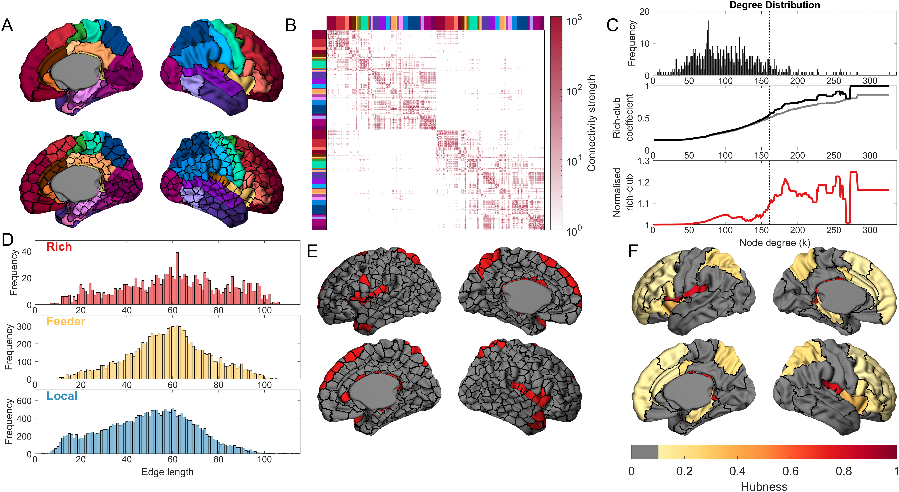
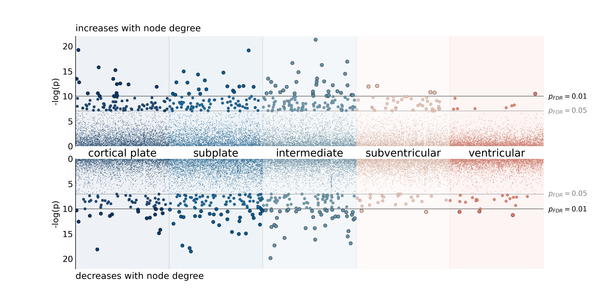
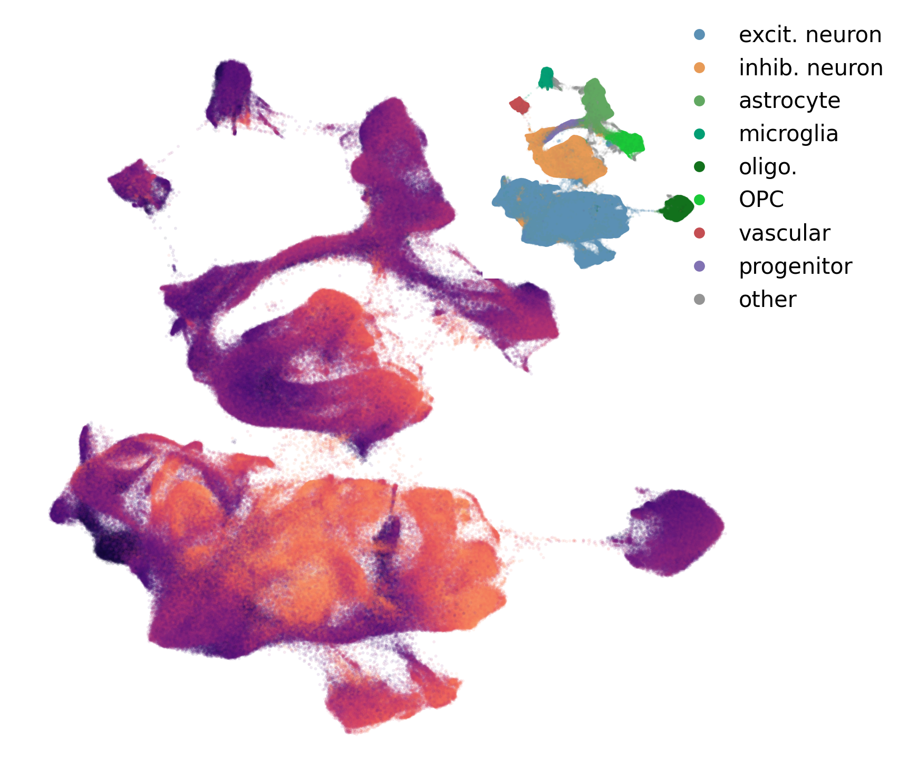

## Transcriptomic divergence of network hubs in the prenatal human brain

see [Oldham & Ball. 2025](https://www.biorxiv.org/content/10.1101/2025.05.26.656237v1)

Code supporting our recent publication analysing the molecular signatures of prenatal cortical regions that form network hubs in the newborn brain. 

Additional supporting data can be downloaded from the &mu;Brain resource on [Zenodo](https://zenodo.org/records/10622337).

## Code repository
see: [**MATLAB code**](MATLAB/README.md) for all network analyses

- surface parcellation at different resolutions
- Rich Club analysis
- sensitivity analyses

see: [**A_run_gene_models.ipynb**](A_run_gene_models.ipynb)  

- filter pre-processed microarray data to remove genes with missing tissue samples
- test spatial associations between nodal degree and gene expression with a robust linear regression model
- plot associations in each tissue compartment that survive correction for multiple comparisons

see: [**B_cell_enrichments.ipynb**](B_cell_enrichments.ipynb)  

- calculate enrichment of hub genes in different cell lineages and cell types
- perform pseudotime analysis to examine maturation of cells expressing hub genes

Other analyses were performed with FUMA's [*gene2func*](https://fuma.ctglab.nl/) module and [*MAGMA*](https://cncr.nl/research/magma/).

## References and related material
Oldham & Ball. *Transcriptomic divergence of network hubs in the prenatal human brain.* bioRxiv. 2025

Velmeshev et al. *Single-cell analysis of prenatal and postnatal human cortical development.* Science. 2023

Ding, S.-L. et al. *Cellular resolution anatomical and molecular atlases for prenatal human brains.* J. Comp. Neurol. 2022.  

Miller, J. A. et al. *Transcriptional landscape of the prenatal human brain.* Nature. 2014.  

